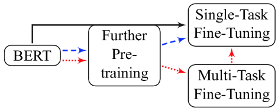
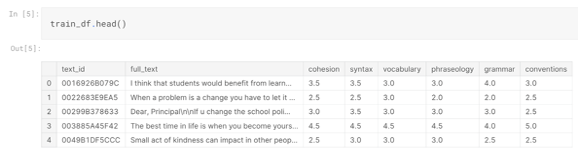
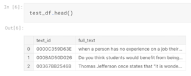
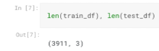
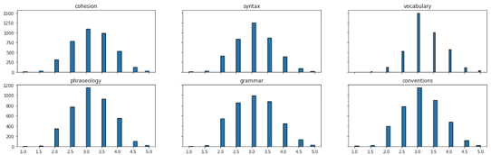
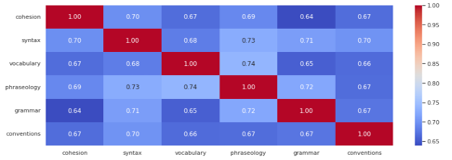
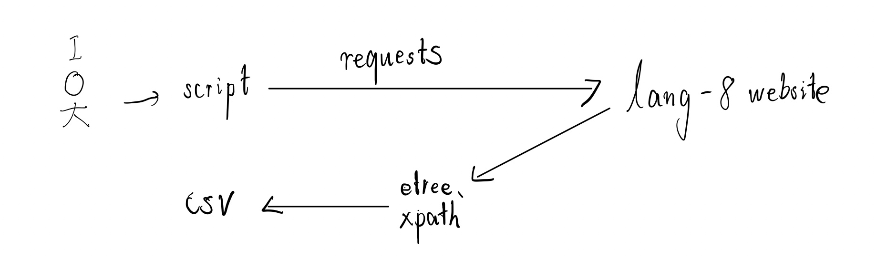
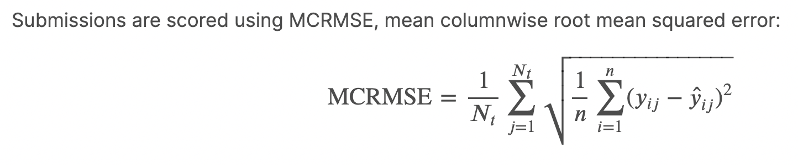
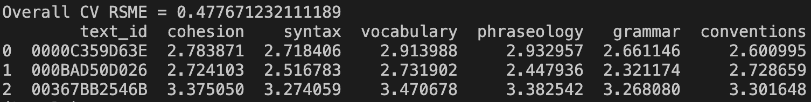

# Report
> Name: Tianzuo Zhang
>
> My contact info: [Twitter](https://twitter.com/dvzhangtz) [Linkedin](https://www.linkedin.com/in/tianzuo-zhang/) Wechat: dvzhangtz [Kaggle](https://www.kaggle.com/milesme)
> 
> I also upload my homework to [Github](https://github.com/dvzhang/feedback-prize-english-language-learning)

# 0. Background
### 0.1.	Goal:
Make an article scoring system for English Language Learners.
### 0.2.	Motivation:
As a Kaggle user ( [my account](https://www.kaggle.com/milesme) ), I found a [very interesting competition](https://www.kaggle.com/competitions/feedback-prize-english-language-learning) . I really hope I can solve this problem in my homework.  

The goal of this competition is to assess the language proficiency of 8th-12th grade English Language Learners (ELLs). Utilizing a dataset of essays written by ELLs will help to develop proficiency models that better support all students.

In the dataset given by the competition, every essays have been scored according to six analytic measures: cohesion, syntax, vocabulary, phraseology, grammar, and conventions.
Each measure represents a component of proficiency in essay writing, with greater scores corresponding to greater proficiency in that measure. The scores range from 1.0 to 5.0 in increments of 0.5.

**Our task is to predict the score of each of the six measures for the essays given in the test set**

# 1. Method description
With this dataset, come to our method. No doubt we must use [Bert or other transformer based model](https://arxiv.org/pdf/1810.04805.pdf&usg=ALkJrhhzxlCL6yTht2BRmH9atgvKFxHsxQ) to solve this nlp question.

The Transformer models are pre-trained on the general domain corpus. But for our task, its data distribution may be different from a transformer trained on a different corpus e.g. [RoBERTa](https://arxiv.org/pdf/1907.11692.pdf%5C) trained on BookCorpus, Wiki, CC-News, OpenWebText, Stories.

What is more, this competition give me a very small train set, if I use it finetune my bert model directly, It must be over fit.

Therefore the idea is, we can further pre-train the transformer with masked language model and next sentence prediction tasks on the domain-specific data. 

As a result, we need some domain specific data.

So here come to the other dataset. The first one is the dataset I scrape from [Lang8](https://lang-8.com/1), it is a multilingo language learning platform. In this platform there are lots of language learner post blogs, writing by the language they are learning.

The second dataset is from [another Kaggle competition](https://www.kaggle.com/competitions/feedback-prize-2021), which is very similar from this one.

Using this two dataset, I continue pretrain my bert and then finetune it with the dataset given by this competition.

# 2. Description of Dataset
I have three dataset:

1, [This competition's dataset](https://www.kaggle.com/competitions/feedback-prize-english-language-learning/data) which can be downloaded from Kaggle Api.

2, Dataset scraped from [Lang-8](https://lang-8.com/1), which can be used for further pretrain.

3, [Dataset downloaded from Kaggle Api](https://www.kaggle.com/competitions/feedback-prize-2021), which can be used for further pretrain.

## 2.1 [This competition's dataset](https://www.kaggle.com/competitions/feedback-prize-english-language-learning/data)

Every essays in the dataset have been scored according to six analytic measures: cohesion, syntax, vocabulary, phraseology, grammar, and conventions.
Each measure represents a component of proficiency in essay writing, with greater scores corresponding to greater proficiency in that measure. The scores range from 1.0 to 5.0 in increments of 0.5.

Our task is to predict the score of each of the six measures for the essays given in the test set.

In these picture, we can see the head row of our train and test set.

I want to mention that the The train set only contains 3,911 texts.The test set CSV only contains 3 texts,which is very, so we must be careful about the overfiting

The labels appears to be normally distributed

And there is a high correlation between them

## 2.2 Dataset scraped from [Lang-8](https://lang-8.com/1)
This dataset can be used for further pretrain.
The logic of the scrape code can be showed in the following picture:

## 2.3 [Dataset downloaded from Kaggle Api](https://www.kaggle.com/competitions/feedback-prize-2021)
This dataset can be used for further pretrain.

# 3. What the script does
* scraper.py was used to scrapy data.

* continuePretrainDataPre.py was used to preprocess the data.
* cotinuePretrain.py was used to further pretrain the model.
* pretrainFtFeedback2.py was used to fine-tune the model and get the result.

# 4. Results and Conclusion 
Using the evaluation metric given by the competition:

My score is 0.477671232111189

The result detail can be found in submission.csv

So, my first conclusion is I made it, I solve this question.
However, the top-1 team's score is 0.433356.
So, my second conclusion is I should do something else to improve my score, which will be mentioned in the "Extensibility" part.

# 5. Maintainability
I use User-Agent pool to increase the maintainability of my scrape program.
I did not use IP-pool, since it is expensive.
So my scrape program is a little slow.

# 6. Extensibility
We can arm my scrape program with IP pool to increase the maintainability.
We can learn from the top score team, we can do in the future:
1. Layer-Wise Learning Rate Dacay
2. Fast Gradient Method
3. Adversarial Weight Perturbation
4. Re-initializing upper layer (normal, xavier_uniform, xavier_normal, kaiming_uniform, . kaiming_normal, orthogonal)
5. Initializing module (normal, xavier_uniform, xavier_normal, kaiming_uniform, kaiming_normal, . orthogonal)
6. Freeze lower layer when you use very large model (v2-xlarge, funnnel, etc.)
7. Loss function, SmoothL1 or RMSE

As all of us use Pytorch, which can be easily extend to this method.

