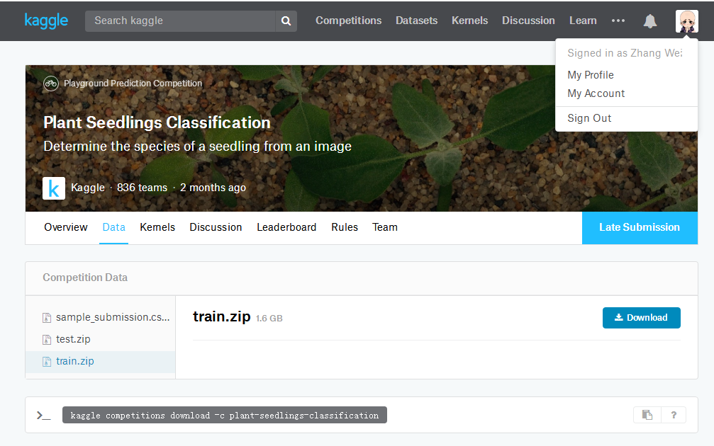
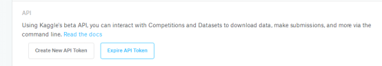
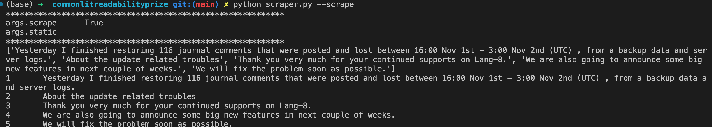
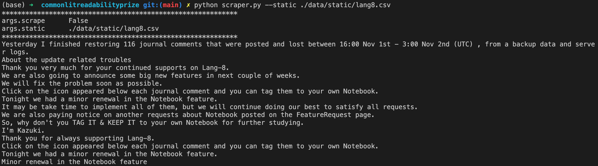
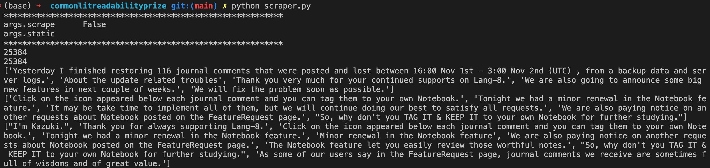

# Readme
> Name: Tianzuo Zhang
>
> My contact info: [Twitter](https://twitter.com/dvzhangtz) [Linkedin](https://www.linkedin.com/in/tianzuo-zhang/) Wechat: dvzhangtz [Kaggle](https://www.kaggle.com/milesme)
> 
> I also upload my homework to [Github](https://github.com/dvzhang/feedback-prize-english-language-learning)


# 0. Background
### 0.1.	Goal:
Make an article scoring system for English Language Learners.
### 0.2.	Motivation:
As a Kaggle user ( [my account](https://www.kaggle.com/milesme) ), I found a [very interesting competition](https://www.kaggle.com/competitions/feedback-prize-english-language-learning) . I really hope I can solve this problem in my homework.  

The goal of this competition is to assess the language proficiency of 8th-12th grade English Language Learners (ELLs). Utilizing a dataset of essays written by ELLs will help to develop proficiency models that better support all students.

In the dataset given by the competition, every essays have been scored according to six analytic measures: cohesion, syntax, vocabulary, phraseology, grammar, and conventions.
Each measure represents a component of proficiency in essay writing, with greater scores corresponding to greater proficiency in that measure. The scores range from 1.0 to 5.0 in increments of 0.5.

**Our task is to predict the score of each of the six measures for the essays given in the test set**

### 0.3 Method description
With this dataset, come to our method. No doubt we must use [Bert or other transformer based model](https://arxiv.org/pdf/1810.04805.pdf&usg=ALkJrhhzxlCL6yTht2BRmH9atgvKFxHsxQ) to solve this nlp question.

The Transformer models are pre-trained on the general domain corpus. But for our task, its data distribution may be different from a transformer trained on a different corpus e.g. [RoBERTa](https://arxiv.org/pdf/1907.11692.pdf%5C) trained on BookCorpus, Wiki, CC-News, OpenWebText, Stories.

What is more, this competition give me a very small train set, if I use it finetune my bert model directly, It must be over fit.

Therefore the idea is, we can further pre-train the transformer with masked language model and next sentence prediction tasks on the domain-specific data. 


As a result, we need some domain specific data.

So here come to the other dataset. The first one is the dataset I scrape from [Lang8](https://lang-8.com/1), it is a multilingo language learning platform. In this platform there are lots of language learner post blogs, writing by the language they are learning.

The second dataset is from [another Kaggle competition](https://www.kaggle.com/competitions/feedback-prize-2021), which is very similar from this one.

Using this two dataset, I continue pretrain my bert and then finetune it with the dataset given by this competition.

# 1. Setup you env
```shell
conda create -n kaggle python=3.7
conda activate kaggle

pip install kaggle
pip install lxml
pip install IPython
pip install matplotlib 
pip install scikit-learn
pip install iterative-stratification==0.1.7

mkdir -p input/commonlitreadabilityprize
```


# 2. Dataset
You can skip this part, use the dataset downloaded directly.
## 2.1 Competition Dataset 
We should download it from Api
### 2.1.1 How to use Kaggle api
Firstly, log in to [Kaggle](https://www.kaggle.com/), go to ACCOUT

Secondly, you can create New Api, getting a kaggle.json file


Thirdly, copy this file to your home/.kaggle
For example, I copy it to my ~/.kaggle, since I use Ubuntu

### 2.1.2 How to download data from Api
**Do not forget join in feedback-prize-english-language-learning, feedback-prize-2021 competition first!**

Or you can skip this part, use the dataset downloaded directly.
Download is easy

```shell
mkdir -p input/feedback-prize-english-language-learning
mkdir -p input/feedback-prize-2021

cd input/feedback-prize-english-language-learning
kaggle competitions download -c feedback-prize-english-language-learning
unzip commonlitreadabilityprize.zip

cd ../feedback-prize-2021
kaggle competitions download -c feedback-prize-2021
unzip feedback-prize-2021.zip
```

## 2.2 Data scraped from Lang-8 website
### 2.2.1 scraper.py --scrape
```shell
python scraper.py --scrape
```
- This will scrape the data but return only 5 entries of each dataset.


### 2.2. scraper.py --static <path_to_dataset>
```shell
python scraper.py --static ./data/static/lang8.csv
```
- This will return the static dataset scraped from the web and stored in database or CSV file


### 2.3. scraper.py
```shell
scraper.py 
```
- Return the complete scraped datasets.
- Kindly remind: it is very very slow, since this website will block crawler's IP, and I did not use IP pool. So I sleep about half minute after I crawl every page. If you must run it, use tmux to keep it running.


# 3. Further Pretrain
## 3.1 Data preperation
```shell
python continuePretrainDataPre.py
```
## 3.2 Train
```shell
python continuePretrain.py
```


# 4. Use the pretrained model in our competition dataset
```shell
python pretrainFtFeedback2.py
```

# 5. Results
Using this evaluation metric:

My score is 0.47741172645010604
The result detail can be found in submission.csv
